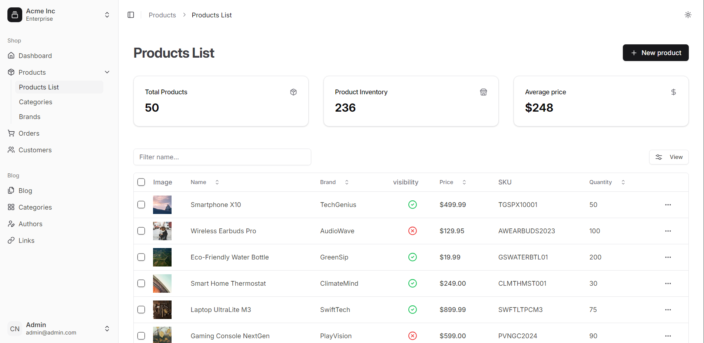

# eCommerce Admin Dashboard



## Overview

This project is an eCommerce admin dashboard built using React, TypeScript, Express, Tailwind CSS, Prisma, and TanStack Router. It provides a comprehensive interface for managing products, categories, brands, orders, and customers.

## Table of Contents

-    [Features](#features)
-    [Installation](#installation)
-    [Usage](#usage)
-    [Contributing](#contributing)
-    [License](#license)

## Features

-    **Frontend**: Built with React, Vite, and Tailwind CSS.
-    **Backend**: Powered by Node.js and Prisma.
-    **Database**: Managed with Prisma ORM.
-    **Routing**: Handled by TanStack Router.
-    **Code Quality**: Ensured with ESLint and Prettier.

## Installation

1. Clone the repository:

     ```sh
     git clone https://github.com/zakaria-lagouader/react-typescript-ecommerce-project
     ```

2. Navigate to the `admin` directory and install dependencies:

     ```sh
     cd admin
     npm install
     ```

3. Navigate to the `backend` directory and install dependencies:
     ```sh
     cd ../backend
     npm install
     ```

## Usage

### Running the Frontend

1. Navigate to the `admin` directory:

     ```sh
     cd admin
     ```

2. Start the development server:
     ```sh
     npm run dev
     ```

### Running the Backend

1. Navigate to the `backend` directory:

     ```sh
     cd backend
     ```

2. Start the backend server:
     ```sh
     npm run dev
     ```

## Contributing

Contributions are welcome! Please open an issue or submit a pull request.

## License

This project is licensed under the MIT License.
